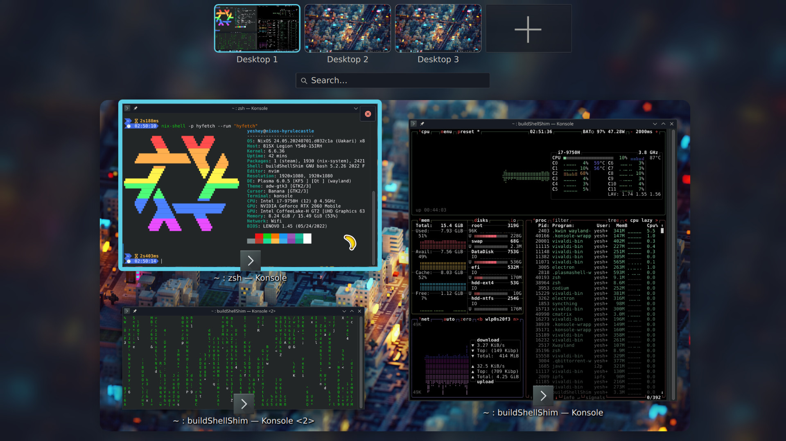
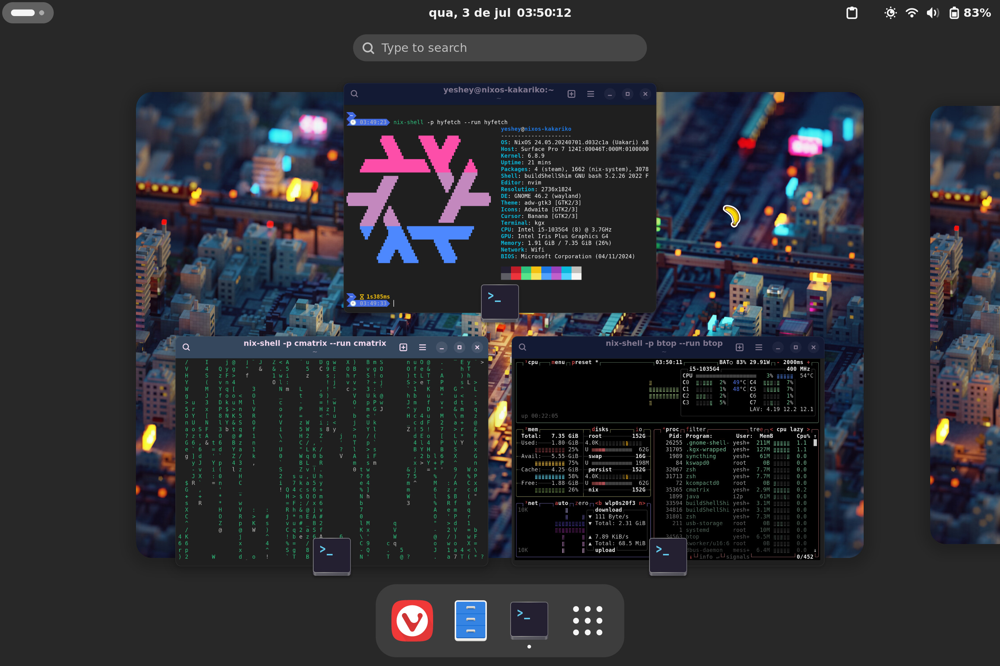

# nix & nixOS Configuration / Linux Config
The spiciest config on the market [😳🥵💦](https://matias.me/nsfw/)

My reproducible nix Configuration & other configuration files.  
More Documentation (for myself) about nixOS in my [TechNotes Repo](https://github.com/Yeshey/TechNotes).  

It has my personal configuration for my Lenovo Legion laptop(`hyrulecastle`), my MS Surface Pro 7(`kakariko`) and my Oracle `aarch64` server(`skyloft`).

## Installing on a new computer

- You might need to create the home manager folder manually `mkdir ~/.local/state/nix/profiles`

- Yo'll have to find the syncthing ID by going to http://127.0.0.1:8384, getting the ID, and adding it in the syncthing config

- You'll have to add the new machine public key to the secrets for agenix with `cat /etc/ssh/ssh_host_rsa_key.pub` and add it in the `secrets/secrets.nix` and rekey the keys `cd ~/.setup/secrets` and `agenix --rekey`.

- Right click on wastebin and configure to delete trash after 7 days, still don't know how to declare this.

- nix-on-droid: install my flake in app by adding [the normal packages](https://nix-on-droid.unboiled.info/upgrade.txt) and running `nix-shell -p git --run "nix-on-droid --flake github:Yeshey/nixOS-Config#nix-on-droid switch"`  
  Then send the ssh keys through adb, connect adb and on your nixOS PC send the keys with:
  ```sh
    nix-shell -p android-tools --run "sudo adb root; sudo adb push /home/yeshey/.ssh/my_identity /data/data/com.termux.nix/files/home/.ssh/my_identity"

    nix-shell -p android-tools --run "sudo adb root; sudo adb push /home/yeshey/.ssh/my_identity.pub /data/data/com.termux.nix/files/home/.ssh/my_identity.pub"

    nix-shell -p android-tools --run "sudo adb root; sudo adb push /home/yeshey/.ssh/config /data/data/com.termux.nix/files/home/.ssh/config"
  ```

## Credits

- Initially introduced to nix and nixOS by [Kylix](https://github.com/kylixafonso) 👀
- First iteration inspiered by [Matthias Benaets'](https://github.com/MatthiasBenaets) [configuration](https://github.com/MatthiasBenaets/nixos-config) and his [video](https://www.youtube.com/watch?v=AGVXJ-TIv3Y);
- Derived from [LongerHV's](https://github.com/LongerHV) [nixos-configuration](https://github.com/LongerHV/nixos-configuration/tree/master);
- Based on [Misterio77's](https://github.com/Misterio77) [nix-starter-configs](https://github.com/Misterio77/nix-starter-configs);
- Inspiered by [pinage404](https://gitlab.com/pinage404) [dotfiles](https://gitlab.com/pinage404/dotfiles)

## Highlights:

- **Structure** 
    - Separation of home manager and nixOS system configuration through a myHome and mySystem modules so it could also be deployed on a home-manager only system the same way [LongerHV's](https://github.com/LongerHV) [nixos-configuration](https://github.com/LongerHV/nixos-configuration/tree/master) is set up;

    - Unstable packages available at `pkgs.unstable.<package>`, [NUR](https://github.com/nix-community/NUR) packages available at `pkgs.nur.<package>` using overlays. Check [Misterio77's](https://github.com/Misterio77) `standard` [nix-starter-configs](https://github.com/Misterio77/nix-starter-configs) for getting started with this structure.

- **Auto Upgrades On Shutdown** - Setting auto upgrades on my desktop PC only on shutdown once every week: [autoUpgradesOnShutdown.nix](https://github.com/Yeshey/nixOS-Config/blob/main/modules/nixos/mySystem/autoUpgradesOnShutdown.nix);

- **Syncthing** - Declaratively set syncthing, including ignore patterns with `userActivationScripts` (TODO: set syncthing as a home manager service): [syncthing.nix](https://github.com/Yeshey/nixOS-Config/blob/main/modules/nixos/mySystem/syncthing.nix);

- **LUKS on LVM with LVM cache** - cache on an SSD for a partition on a microSD on `kakariko`: [boot.nix](https://github.com/Yeshey/nixOS-Config/blob/main/nixos/kakariko/boot.nix), my guide on doing this in [my TechNotes](https://github.com/Yeshey/TechNotes/blob/main/guides/LUKS%20on%20LVM%20with%20cache%20on%20nixOS.md);

- **pci-passthrough** - for passing my `NVIDIA GeForce RTX 2060 Mobile` to a virt-manager VM and using my intel processor for the host: [pci-passthrough.nix](https://github.com/Yeshey/nixOS-Config/blob/main/nixos/hyrulecastle/pci-passthrough.nix), but better yet:

- **VGPU** - Unlocked VGPU functionality on my consumer nvidia card: [vgpu.nix](https://github.com/Yeshey/nixOS-Config/blob/main/nixos/hyrulecastle/vgpu.nix). Using my module, more details there: [nixos-nvidia-vgpu](https://github.com/Yeshey/nixos-nvidia-vgpu);

- **i2p firefox profile** - Home manager auto creates a firefox profile able to access the hidden i2p net when `services.i2p.enable` is enabled on the host, and makes a `.desktop` file for easy access, `i2pFirefoxProfile` option: [firefox.nix](https://github.com/Yeshey/nixOS-Config/blob/main/modules/home-manager/myHome/homeApps/firefox.nix);

- **Safe-rm** - I nuked my PC once by running `sudo rm -r /*` isntead of `sudo -r rm ./*`, so i decided to change all my `rm` calls to `safe-rm` calls through changing the binary and adding aliases, both in `myHome`: [safe-rm.nix](https://github.com/Yeshey/nixOS-Config/blob/main/modules/home-manager/myHome/safe-rm.nix); and in `mySystem`: [safe-rm.nix](https://github.com/Yeshey/nixOS-Config/blob/main/modules/nixos/mySystem/safe-rm.nix);

- **OneDriver** - home-manager module for [onedriver](https://github.com/jstaf/onedriver) that auto clears cache every 3 days, but Microsoft(🫠) [changed the user storage limits](https://blog.shi.com/next-generation-infrastructure/cloud/are-you-prepared-for-the-end-of-office-365-a1-plus-and-unlimited-cloud-storage/#:~:text=All%20school%20tenants,tenant%E2%80%99s%20100TB%20pool.), so now we only have 100GB per user instead of 1TB (for my uni account), so it's not as worth anymore 🥲, they were just reeling companies in before pulling the rug out, of course: [onedriver.nix](https://github.com/Yeshey/nixOS-Config/blob/main/modules/home-manager/myHome/onedriver.nix). Also has a agenix module that adds the json with the credentials to the right place, and takes into account the auto cleanups: [onedriver.nix](https://github.com/Yeshey/nixOS-Config/blob/main/modules/home-manager/myHome/agenix/onedriver.nix);

- **Substituters** - Uses a bunch of substituters for extra caches to hopefully make rebuilds faster: [default.nix](https://github.com/Yeshey/nixOS-Config/blob/main/modules/nixos/mySystem/default.nix). Also in my module to activate when home manager is used standalone (untested): [non-nixos.nix](https://github.com/Yeshey/nixOS-Config/blob/main/modules/home-manager/myHome/non-nixos.nix);

- **Agenix** - Using [agenix](https://github.com/ryantm/agenix) both at system (`mySystem` - [default.nix](https://github.com/Yeshey/nixOS-Config/blob/main/modules/nixos/mySystem/agenix/default.nix)):  and at user (`myHome` - [default.nix](https://github.com/Yeshey/nixOS-Config/blob/main/modules/home-manager/myHome/agenix/default.nix)) levels, they grab secrets from `/secrets`.

- **VSCodium** - Visual Studio Codium, the open source version of VSC, configuration settings propagated to appropriate locations for VScodium, VSCode and openvscode-server, has a bunch of extensions and configuration for latex nix language server, settings for special characters to work with starship theme in terminal, java, etc: [vscodium/default.nix](https://github.com/Yeshey/nixOS-Config/blob/main/modules/home-manager/myHome/homeApps/vscodium/default.nix)

- **piper-tts as Text to Speach** - A single english voice, instead of the robotic default voice: [piperTextToSpeech.nix](https://github.com/Yeshey/nixOS-Config/blob/main/modules/nixos/mySystem/piperTextToSpeech.nix)

## Gallery

### HyruleCastle



### Kakariko



&nbsp;

&nbsp;

&nbsp;

[story.md 🥀](https://github.com/Yeshey/nixOS-Config/blob/main/story.md)
